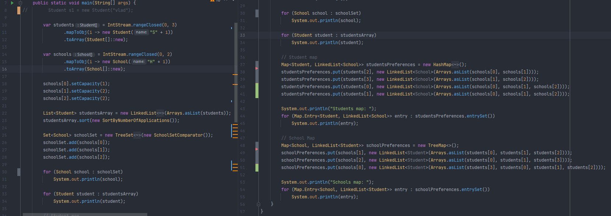
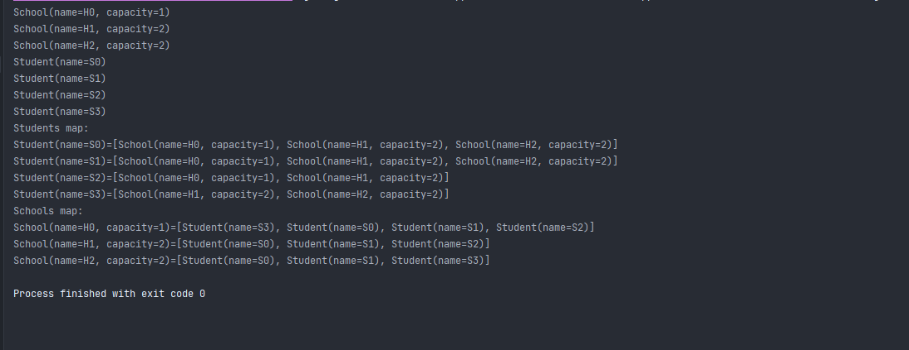
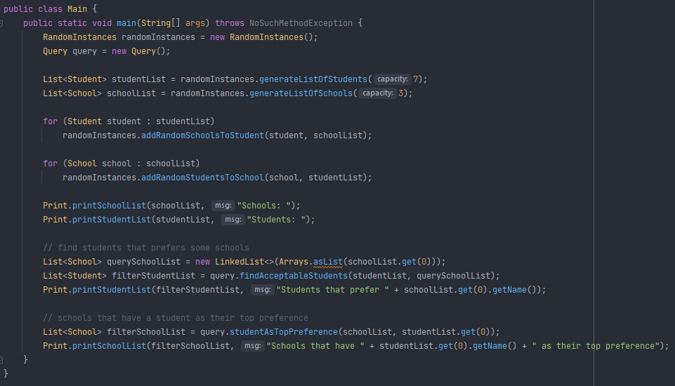
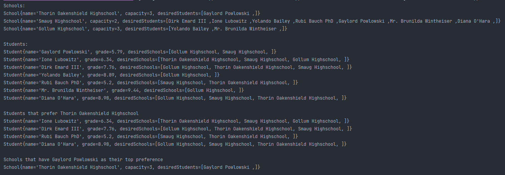
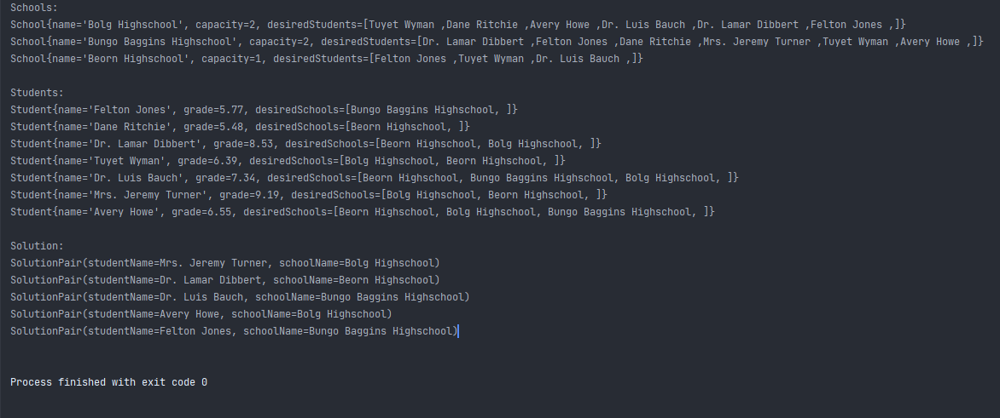
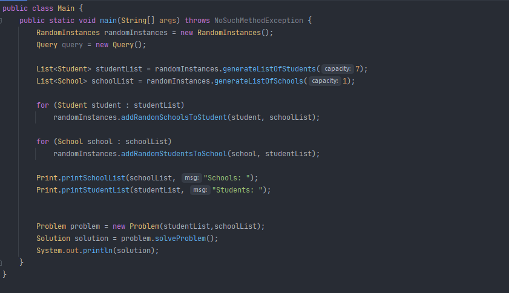
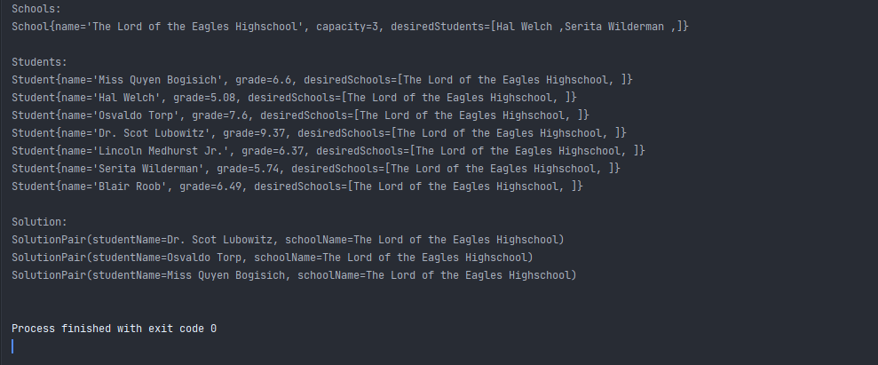

# Advanced Programming - Lab 4

This repository contains all the problems proposed for the fourth laboratory in Advanced Programming course
solved by me.

## Essential tools

You need to have Java RE or JDK >= 8 installed on your computer.

## How to run it?

1. Open project with IntelliJ IDEA

Clone this repository and open it with IntelliJ IDEA. Build this project
(shortcut Ctrl+F9) then go to Run->Run...(shortcut Alt+Shift+F10) and select
the file you want to run.

2. Compile and run the programs using CMD

Go to the folder where the file is located. Open a new terminal here.

If you want to compile the file Main.java you must type the command.

```bash
javac -d . Main.java
```

After you compiled it, if you want to start the program you can type the
following command

```bash
java packageName.Main
```

where to packageName is the name of the package which includes the file Main.java.

## Problem

### The Student / High School Admission Problem (SAP)

An instance of SAP involves a set of students and a set of high schools, each student seeking admission to one school, and each school having a number of available places (its capacity).
Each student ranks some (acceptable) schools in strict order, and each school ranks its applicants in some order.
A matching is a set of pairs (student, school) such that each student is assigned to at most one school and the capacities of the schools are not exceeded.
A matching is stable if there is no pair (s, h) such that s is assigned to h' but s prefers h better than h' and h prefers s better than some of its assigned students. We consider the problem of creating a stable matching between students and schools.

Example: 4 students S0,S1,S2,S3, 3 high schools H0,H1,H2, capacity(H0)=1, capacity(H1)=2, capacity(H2)=2.

students preferences

- S0: (H0, H1, H2)
- S1: (H0, H1, H2)
- S2: (H0, H1)
- S3: (H0, H2)

schools preferences

- H0: (S3, S0, S1, S2)
- H1: (S0, S2, S1)
- H2: (S0, S1, S3)

A solution for this example might be: [(S0:H1),(S1:H2),(S2:H1),(S3:H0)]

## Tasks

### Compulsory

- [x] Create an object-oriented model of the problem. You should have at least the following classes: Student, School and the main class.
- [x] Create all the objects in the example using streams.
- [x] Create a list of students, using LinkedList implementation. Sort the students, using a comparator.
- [x] Create a set of schools, using a TreeSet implementation. Make sure that School objects are comparable.
- [x] Create two maps (having different implementations) describing the students and the school preferences and print them on the screen.




### Optional

- [x] Create a class that describes the problem and one that describes a solution (a matching) to this problem.
- [x] Using Java Stream API, write queries that display the students who find acceptable a given list of schools, and the schools that have a given student as their top preference.
- [x] Use a third-party library in order to generate random fake names for students and schools.
- [x] Implement an algorithm for creating a matching, considering that each student has a score obtained at the evaluation exam and the schools rank students based on this score.
- [x] Test your algorithm.










### Bonus

- [ ] Consider the case in which a school can rank the students based on their specific criteria.
- [ ] Implement the Gale Shapley algorithm in order to find a stable matching.
- [ ] Consider the case in which preferences are not necessarily strict. Some consecutive preferences in an element's list may form a tie.
For example S1: H1, [H2,H3] means that S1 prefers H1 over H2 and H3, but H2 and H3 have no precedence one over the other.
- [ ] Prove that in the case of SAP with ties, a problem may have multiple stable matchings, not all of the same size.
- [ ] Check out other examples of matching in practice.